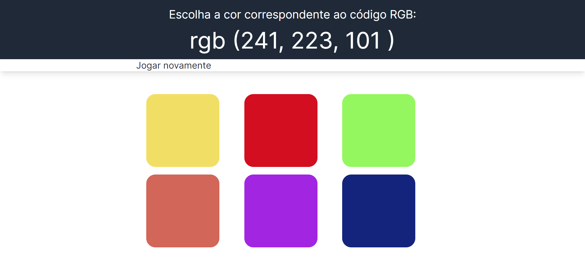
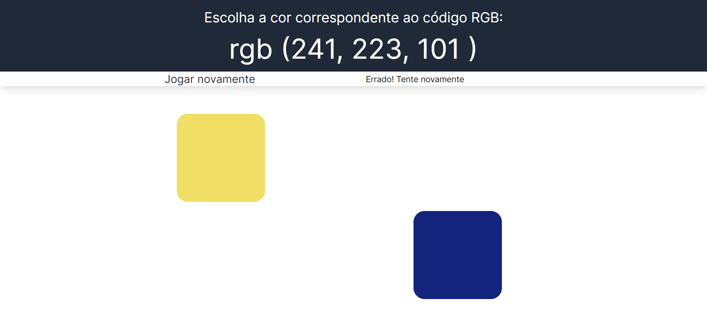
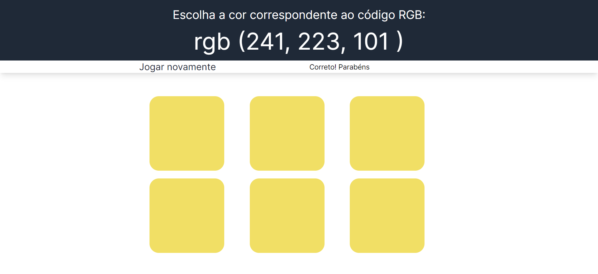

# COLORS GAME

The challenge is simple: an RGB code will be generated, and you'll have to guess which one corresponds to that code. Colors are represented by imitations of red (R), green (G) and blue (B). You'll see six color options on the screen, and your mission is to choose the correct color that matches the displayed RGB code. Test your ability to identify cores and have fun in this exciting visual challenge game!

## How to Clone and Run

To clone the project repository and run it on your local machine, follow the instructions below:

1. Clone the repository using the command `git clone <repository URL>`.
2. Navigate to the project directory: `cd login-registrar-next`.
3. Install the dependencies using the command `npm install`.
4. Run the application using the command `npm run dev`.
5. Access the application in your browser at `http://localhost`.

# Screens:

## DEFAULT

## WRONG ANSWERS

## CORRECT ANSWERS

## Technologies Used

- NextJS
- Tailwind
- TypeScript